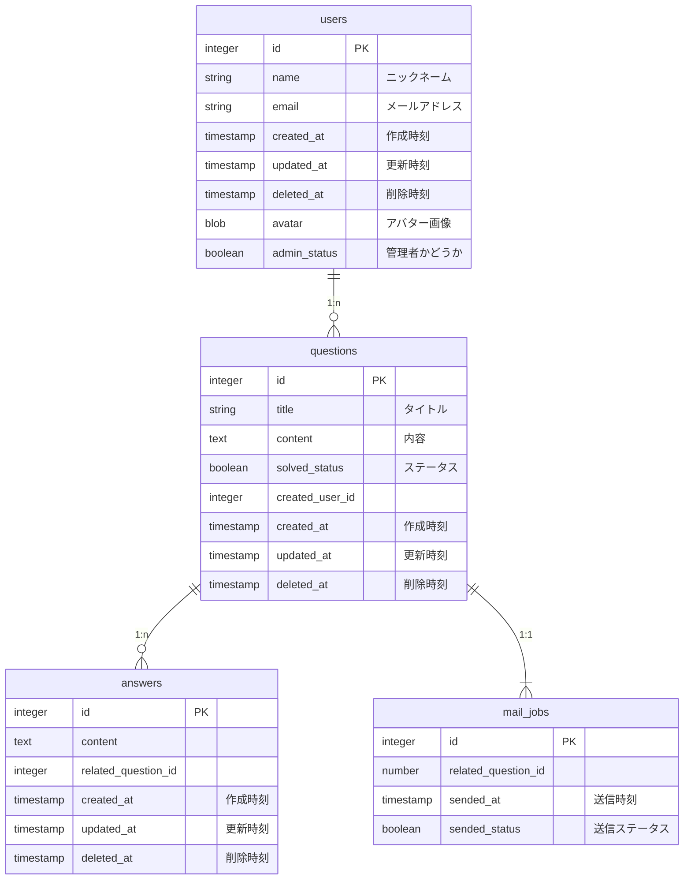

### 環境構築

`bundle install`

`rails s`

### 要件

- ログインログアウト機能がある
- ユーザーはニックネームとアバター画像を登録できる
- ユーザーは質問を投稿できる
- ユーザーは自分の質問を編集・削除できる
- ユーザーは質問に対して回答ができる
- ユーザーは質問を解決済み状態に変更できる
- ユーザーは質問を検索できる
- 質問があった際に全員に対して質問があった旨をメールで通知する（ただし自分は除く）
- 質問に対して回答があった場合は質問者および当該質問に回答したユーザーに対してメールで通知する。（ただし自分は除く）
- 質問はページングできる
- 管理画面がある
- 管理画面へは権限を付与されたユーザーしか入れない
- 管理画面では全てのリソースを削除できる

### テーブル設計

### エンドポイント・コントローラ設計

| やりたいこと                             | HTTP メソッド | エンドポイント                  | コントローラ#アクション |
| ---------------------------------------- | ------------- | ------------------------------- | ----------------------- |
| ユーザー登録画面を表示する               | GET           | /users/new                      | users#new               |
| ユーザー登録をする                       | POST          | /users                          | users#create            |
| ログイン画面を表示する                   | GET           | /login                          | sessions#new            |
| ログインする                             | POST          | /login                          | sessions#create         |
| ログアウトする                           | Delete        | /logout                         | sessions#destroy        |
| 質問一覧を表示する（全て）               | GET           | /questions                      | questions#index         |
| 質問一覧を表示する（未解決）             | GET           | /questions/solved               | questions#solved        |
| 質問一覧を表示する（解決済み）           | GET           | /questions/unsolved             | questions#unsolved      |
| 質問投稿ページを表示する                 | GET           | /questions/new                  | questions#new           |
| 質問投稿をする                           | POST          | /questions                      | questions#new           |
| 質問詳細を表示する                       | GET           | /questions/:id                  | questions#show          |
| 質問編集ページを表示する                 | GET           | /questions/:id/edit             | questions#edit          |
| 質問を削除する                           | DELETE        | /questions/:id                  | questions#destroy       |
| 回答する                                 | POST          | questions/:questions_id/answers | answers#create          |
| ユーザー一覧を表示する                   | GET           | /users                          | users#index             |
| 管理画面用のログインページを表示する     | GET           | /admin/login                    | admin#sessions#new      |
| 管理画面用のログインをする               | POST          | /admin/login                    | admin#sessions#create   |
| （管理画面）質問一覧ページを表示する     | GET           | /admin/questions                | admin#questions#index   |
| （管理画面）質問を削除する               | DELETE        | /admin/questions/:id            | admin#questions#destroy |
| （管理画面）ユーザー一覧ページを表示する | GET           | /admin/users                    | admin#users#index       |
| （管理画面）ユーザーを削除する           | DELETE        | /admin/users/:id                | admin/users#destroy     |
